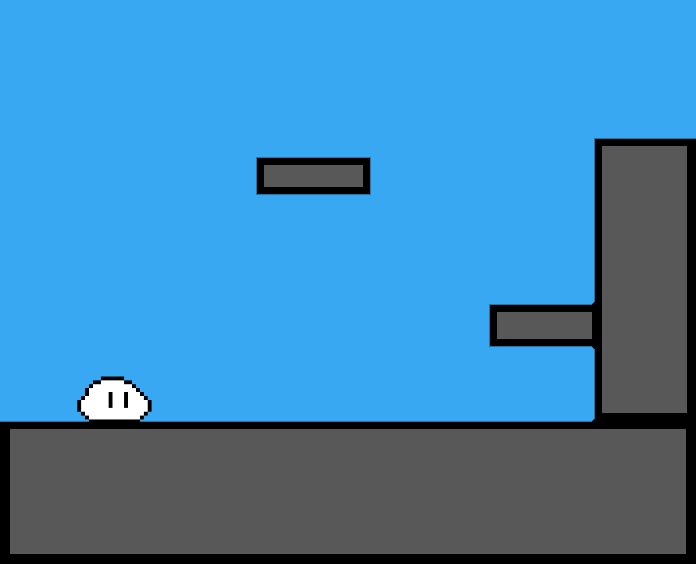

# What is this?
This is an exercise and a portfolio piece. I am using it to understand how to use a state machine pattern in an interesting way. While practicing my art and animation in a productive way.

This is not going to be a 'full game' but more of a tech demo and learning experience for myself. 

The 'game' will consist of a single room sporting a few platforms, and the player character.

**Moving** and **Jumping** is all you'll be able to do. no additional mechanics *(on this repo at least)* 

#### To outline the scope... 

The finished product will look something like this:

#### There will be: 

- A **Character Controller** with the following functionality:
  -  move **left** and **right**
  - ability to **jump** 
  - ability to **crouch**
- A number of **Animated Sprites**:
  - idle
  - moving 
  - stopping
  - jumping
  - falling 
  - crouching

### How?

Make diagrams of the class structure

and visualize the architecture

make a checklist 

